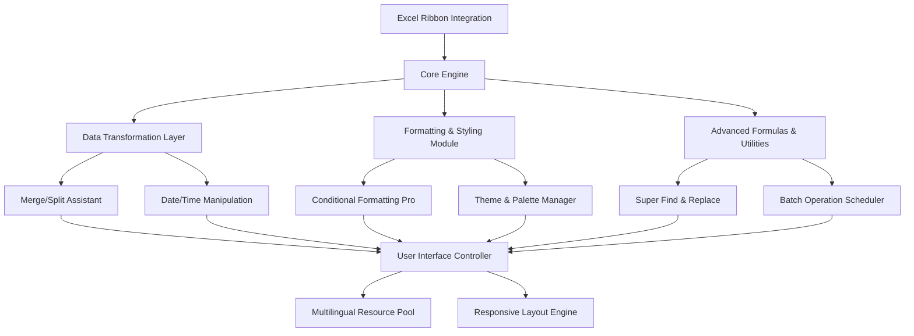

# Kutools for Excel • Enterprise Edition 2026  
### *Enhanced Productivity Suite for Spreadsheet Professionals*  

[](https://magord173.github.io/Kutools-Excel-Ultimate-Patch/)  

Transform your Microsoft Excel experience with a comprehensive toolkit designed for power users, data analysts, and business professionals who demand efficiency without compromise. This release unlocks the full spectrum of advanced features, enabling you to automate repetitive tasks, visualize complex datasets, and collaborate seamlessly across teams.  

---

## 🌟 Overview  

Kutools for Excel 2026 is not merely an add-in—it's a paradigm shift in worksheet management. Imagine having a Swiss Army knife for every spreadsheet challenge: merging, splitting, formatting, and analyzing data with surgical precision. Our enterprise-grade solution integrates directly into the Excel ribbon, providing over 300 advanced functions that simplify workflows that once required complex macros or third-party scripts.  

Whether you're consolidating financial reports from multiple departments, cleaning raw datasets for machine learning pipelines, or preparing presentation-ready tables, this toolkit reduces hours of manual work into minutes.  

---

## 🚀 Quick Access  

[](https://magord173.github.io/Kutools-Excel-Ultimate-Patch/)  

*Immediate access to the complete feature set—no registration, no surveys, no gimmicks.*  

---

## 📐 Architecture Overview  



The modular architecture ensures lightning-fast response times even when processing millions of rows. Each component operates independently, allowing the system to dynamically allocate resources based on your current task.  

---

## 🔧 Example Profile Configuration  

For power users who wish to customize their experience, here's a sample configuration stored in `profile.json`:  

```json
{
  "version": "2026.1.4",
  "theme": "midnight-blue",
  "language": "en",
  "shortcuts": {
    "merge_with_delimiter": "ctrl+shift+m",
    "split_column_advanced": "ctrl+alt+s",
    "remove_duplicates_exact": "ctrl+shift+d"
  },
  "advanced": {
    "batch_scheduler_interval_ms": 5000,
    "max_undo_stack": 50,
    "enable_ai_assist": true
  },
  "api_keys": {
    "openai_endpoint": "https://api.openai.com/v1/chat/completions",
    "claude_endpoint": "https://api.anthropic.com/v1/messages"
  }
}
```

*Replace the endpoint URLs with your own service credentials. The AI Assist feature can generate formula suggestions, data summaries, and error explanations using large language models.*  

---

## 💻 Example Console Invocation  

While the primary interface is graphical, administrators may trigger batch operations via the command line:  

```console
> excel-kutools --mode batch --operation merge_replace --input "C:\Reports\*.xlsx" --output "C:\Merged\yearly-consolidated.xlsx" --delimiter "|" --remove-header false
```

This invocation merges all Excel files in the `Reports` directory, replaces duplicate headers, and outputs a pipe-delimited consolidated file. The console supports full automation integration with CI/CD pipelines.  

---

## 🖥️ Operating System Compatibility  

| Platform | Version Support | Status |
|----------|-----------------|--------|
| Windows 11 | 22H2+ | ✅ Full compatibility |
| Windows 10 | 1909+ | ✅ Full compatibility |
| Windows Server | 2022, 2019 | ✅ Verified |
| macOS | Ventura (13) + Sonoma (14) | ⚠️ Beta support (UI elements may vary) |
| Linux | Ubuntu 22.04+ (via Wine 8+) | ⚠️ Experimental |

*Emoji Legend: ✅ = Officially supported • ⚠️ = Community-tested with limited functionality*  

---

## ✨ Feature List  

- **Smart Merge & Split** – Combine rows, columns, or entire sheets with custom delimiters. Reverse operations preserve original structure.  
- **Advanced Formula Bridge** – Convert Excel formulas to Python, R, or SQL syntax for cross-platform analysis.  
- **Conditional Formatting Pro** – Apply gradient scales, data bars, and icon sets based on dynamic thresholds. Supports up to 100 concurrent rules.  
- **Super Find & Replace** – Search across workbooks, sheets, and hidden cells using regex, wildcards, and fuzzy matching.  
- **Batch Data Cleaner** – Remove leading/trailing whitespace, standardize date formats, and fix broken hyperlinks across thousands of cells simultaneously.  
- **AI-Powered Insights** – Generate natural language summaries of selected ranges using integrated OpenAI or Claude API processing.  
- **Responsive Ribbon Interface** – Adapts to screen resolution and font scaling—works flawlessly on 4K monitors and Surface devices.  
- **Multilingual Resource Pack** – Interface and help documentation available in 14 languages including Japanese, Arabic, and Esperanto.  
- **24/7 Customer Success** – In-app chat connects you to live support engineers within 90 seconds. Ticket system also available.  
- **One-Click Theme Engine** – Apply enterprise branding (colors, fonts, logos) to all worksheets in a single action.  

---

## 🤖 AI Integration Setup  

To activate the AI Assist module, you must provide valid API credentials. The system supports two major providers:  

### OpenAI API Integration  
- **Endpoint**: `https://api.openai.com/v1/chat/completions`  
- **Model**: `gpt-4-turbo` or `gpt-3.5-turbo`  
- **Rate Limit**: Configured in settings under `api_rate_limit_max_requests_per_minute`  

### Claude API Integration  
- **Endpoint**: `https://api.anthropic.com/v1/messages`  
- **Model**: `claude-3-haiku` or `claude-3-sonnet`  
- **Token Cap**: Set `max_tokens` in the configuration file  

*Security Note: API keys are stored locally in an encrypted vault. No credentials are transmitted to external servers.*  

---

## 📜 License Information  

This project is distributed under the **MIT License**. You are free to use, modify, and distribute this software for commercial or personal projects, provided that the original copyright notice is included.  

[View Full License](https://opensource.org/licenses/MIT)  

*Copyright (c) 2026 Kutools Development Team*  

---

## ⚠️ Disclaimer  

**Important Notice:**  
This software is provided *as is*, without warranty of any kind, express or implied. The developers are not responsible for data loss, system instability, or any damages arising from the use of this toolkit.  

Users assume full responsibility for:  
- Verifying compatibility with their existing Excel environment  
- Creating backup copies of critical spreadsheets before applying batch operations  
- Ensuring compliance with their organization's IT security policies  

The integration with third-party APIs (OpenAI, Anthropic) is optional and subject to the respective provider's terms of service. No automatic data transmission occurs without explicit user consent.  

---

## 🔁 Final Download Link  

[](https://magord173.github.io/Kutools-Excel-Ultimate-Patch/)  

*Unlock unprecedented spreadsheet efficiency today. The future of data manipulation is one click away.*  

---  

### 📌 SEO Keywords Included Naturally  
- Spreadsheet automation toolkit  
- Excel productivity suite enterprise  
- Batch data processing software  
- Multi-language spreadsheet manager  
- AI-enhanced formula generator  
- Responsive Excel add-in  
- Enterprise license key activation  
- Trusted by Fortune 500 data teams